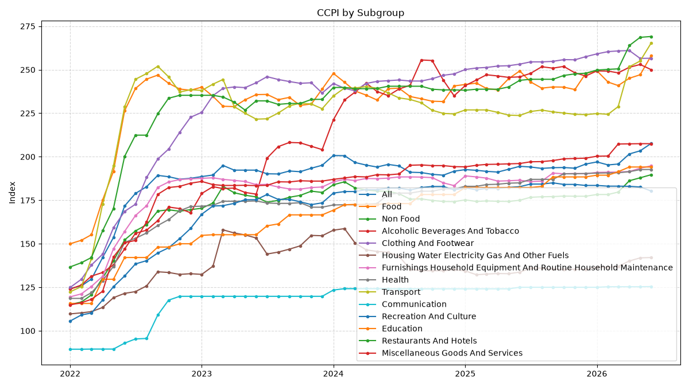

# Department of Census and Statistics, Sri Lanka 🇱🇰

This repo contains public data parsed from [https://www.statistics.gov.lk/](https://www.statistics.gov.lk/).

## Colombo Consumer Price Index (CCPI)

- [Movements of the CCPI `2026-06`](data/ccpi/movements-of-the-ccpi/2026/2026-06-01)
- [Movements of the CCPI Core `2026-06`](data/ccpi/movements-of-the-ccpi-core/2026/2026-06-01)
- [CCPI by subgroup `2026-06`](data/ccpi/ccpi-by-subgroup/2026/2026-06-01)
- [Inflation by Food and Non Food Groups `2026-06`](data/ccpi/inflation-by-food-and-non-food-groups/2026/2026-06-01)

## Charts

### CCPI

### CCPI Inflation

### CCPI by Food and Non Food

### Inflation by Food and Non Food

### CCPI by Subgroup

### Inflation by Subgroup

